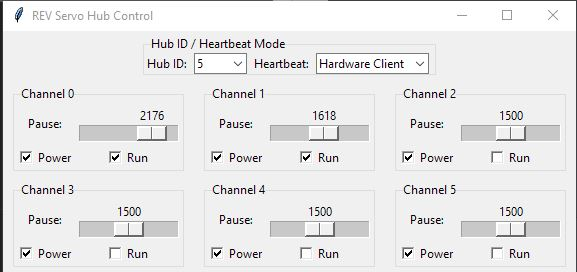

# REV Servo Hub – CAN Protocol (Unofficial Documentation)

## ⚠️ Disclaimer

This protocol is **unofficial and reverse-engineered**. For official documentation or firmware support, contact [REV Robotics](https://www.revrobotics.com/).

Demo script: using canalystii converter


Setup:


## 📌 Overview

(This document is ChatGPT generated cuz I am lazy. However the script do work.)

The REV Servo Hub communicates over the CAN bus using **29-bit Extended IDs**, supporting up to **6 servo channels** grouped as:

- **Group 0**: Channels 0–2  
- **Group 1**: Channels 3–5

Each hub is assigned a unique **Hub ID** (from 1 to 63). The CAN IDs are dynamically generated based on this Hub ID and the group.

---

## 🔢 Hub ID → CAN ID Mapping

### 📤 Transmit (to Hub)

| Group    | Formula                          | Bitwise Explanation                     |
|----------|----------------------------------|------------------------------------------|
| Group 0  | `0x0C050000 | hub_id`            | Base = `0x0C050000`, OR with hub ID      |
| Group 1  | `0x0C050040 | hub_id`            | Base = `0x0C050040`, OR with hub ID      |

**Example (Hub ID = 3)**:
- Group 0 → `0x0C050003`
- Group 1 → `0x0C050043`

**Example (Hub ID = 5)**:
- Group 0 → `0x0C050005`
- Group 1 → `0x0C050045`

---

### 📥 Receive (from Hub)

| Group    | Formula                          | Bitwise Explanation                     |
|----------|----------------------------------|------------------------------------------|
| Group 0  | `0x0C05B880 | hub_id`            | Base = `0x0C05B880`, OR with hub ID      |
| Group 1  | `0x0C05B8C0 | hub_id`            | Base = `0x0C05B8C0`, OR with hub ID      |

**Example (Hub ID = 3)**:
- Group 0 → `0x0C05B883`
- Group 1 → `0x0C05B8C3`

**Example (Hub ID = 5)**:
- Group 0 → `0x0C05B885`
- Group 1 → `0x0C05B8C5`

---

## 📤 Transmit Frame Format

Each command frame is **7 bytes**:

| Byte(s) | Description                                  |
|---------|----------------------------------------------|
| 0–1     | Pause for Channel A (uint16, little endian)  |
| 2–3     | Pause for Channel B (uint16, little endian)  |
| 4–5     | Pause for Channel C (uint16, little endian)  |
| 6       | Run/Power bitmask (1 byte)                   |

### ⏱ Pause
- Range: `500` to `2500`
- Controls PWM-style pulse length

### ⚙️ Run/Power Bitmask

| Bit | Meaning         | Channel |
|-----|------------------|---------|
| 0   | Run              | 0       |
| 1   | Run              | 1       |
| 2   | Run              | 2       |
| 3   | Power            | 0       |
| 4   | Power            | 1       |
| 5   | Power            | 2       |
| 6–7 | (Reserved)       | —       |

> Example: `0x3F = All channels powered and running`

---

## 🛰 Keepalive (Fake Hardware Client)

The Servo Hub requires a keepalive frame to enable.

| Purpose     | CAN ID      | Data     |
|-------------|-------------|----------|
| Keepalive   | `0x000502C0`| `[0x01]` |

- Should be sent **every 100ms** (or faster)

---

## 🛰 Keepalive (roboRIO)

If roboRIO heartbeat frame is used, fake hardware client frame will no longer enable device until servo hub is power cycled.

For more information, [here](https://github.com/sikaxn/frc-canbus-heartbeat/tree/main).

Note: Use this in official FRC robot is illegal. 
Note2: You don't need to send any keep alive frame if you're connected to roboRIO. As roboRIO itself will send this frame for you (if enabled using DS).

---

## 📥 Readback Format

When active, the hub sends state feedback:

| Byte(s) | Meaning                        |
|---------|--------------------------------|
| 0–5     | Unknown (possibly reserved)    |
| 6       | Run/Power bitmask (same format as TX) |

If powered off or disabled, bitmask = `0x00`.

---

## 🧠 Implementation Tips

- Always send **keepalive** at regular intervals
- Any UI interaction should immediately trigger a CAN message
- Avoid sending conflicting power/run states
- Only use Hub IDs from **1 to 63**

---

## 🛠 Example Frame

```
Hub ID: 3
Group: 0
CAN ID: 0x0C050003
Payload: DC 05 C4 09 F4 01 3F

Meaning:
- Pause CH0: 1500 (0x05DC)
- Pause CH1: 2500 (0x09C4)
- Pause CH2: 500  (0x01F4)
- All channels power & run
```

---

## 🧪 Tools & Integration

- Python tool using [`python-can`](https://python-can.readthedocs.io/) and `canalystii` backend works well for testing
- Extended IDs must be supported by your interface

---

